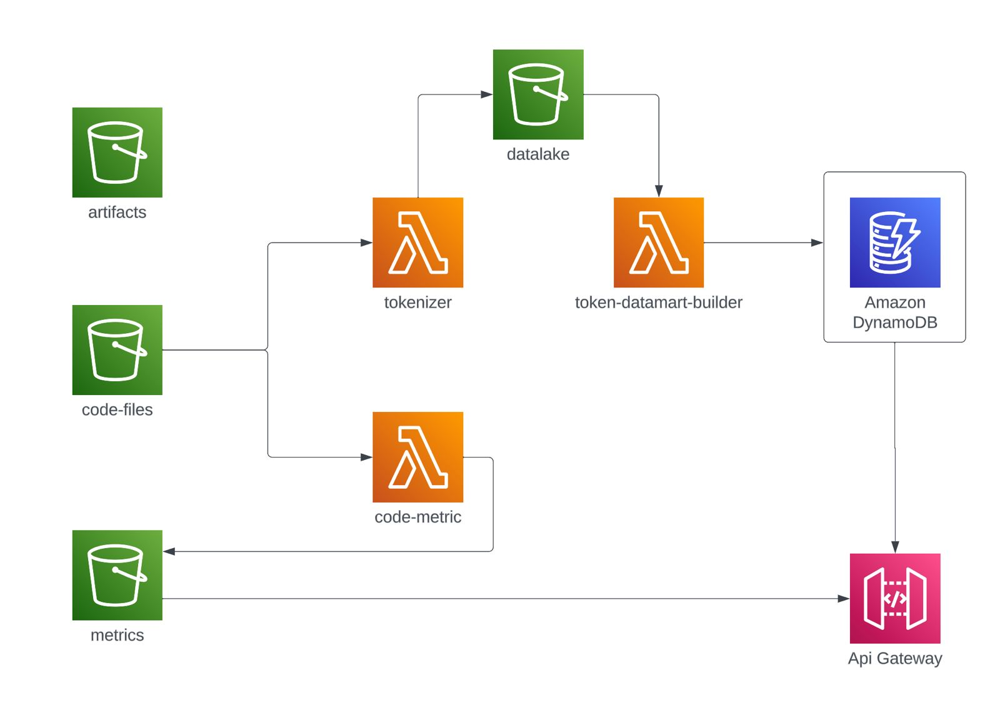

# Git-Radar
[](https://skillicons.dev)

### Project Description
This project is structured in two key parts, each contributing uniquely to the overall functionality of the suggester: metric collection and code file tokenization. Both phases are integrated into AWS infrastructure to provide a robust and efficient suggester.

### AWS Infrastructure Structure
#### S3 Buckets
1. **Artifacts S3 (artifacts):**
   - Stores essential project artifacts, such as modules required for lambda functions, CloudFormation files, among others.

2. **Code Files S3 (code-files):**
   - Stores source codes in JSON format, which include crucial information such as the file name and code. Files in this bucket are the raw material for tokenization and metric collection operations.

3. **Metrics S3 (metrics):**
   - Designated space for storing metrics obtained from files in the Code Files S3. The `code-metric` Lambda is triggered in response to the introduction of a new file in the Code Files S3, generating metrics such as the number of lines and maximum indentation.

4. **Datalake S3 (datalake):**
   - Here, tokenized codes are stored in JSON format, generated by the `tokenizer` Lambda. This lambda is activated when it detects a notification of a new file introduced in the Code Files S3, returning the code in its tokenized version and storing it in this bucket.

#### Lambdas
1. **Lambda Tokenizer:**
   - Triggered by notifications from the Code Files S3, the `tokenizer` Lambda takes code files, tokenizes them, and stores the tokenized versions in the Datalake S3.

2. **Lambda Code Metric:**
   - This Lambda is triggered in response to notifications from the Code Files S3. It takes code files, calculates metrics such as the number of lines and maximum indentation, and stores these metrics in the Metrics S3.

3. **Lambda Token-Datamart-Builder:**
   - Triggered by notifications from the Datalake S3, this Lambda takes the tokenized text and creates n-grams with a determined window. The n-grams are stored in a DynamoDB database, thus providing a rich dataset for the suggester.

4. **DynamoDB Database**
   - Stores the different n-grams formed by the `token-datamart-builder` Lambda in JSON format. The structure includes a "context" field representing the words within the window and a "next" field indicating the next word to complete.

#### APIs
All the questions that you want to ask must be carried out from the API that it supports the token-suggester module, both to obtain the next token given a list of words, and to obtain a certain metric on one of the processed files. Therefore, we can differentiate two main routes within this api.

1. On the one hand, we are in charge of giving the user the next token. To access it, you must follow the path /gitradar/token-suggester/next/:word, with word being a mandatory parameter.

2. On the other hand, we have the path /gitradar/code-metric/:file/:metric, which returns the value of the desired metric for the indicated file.




# Usage Instructions

Follow the steps below to correctly configure and execute the development environment. Before starting, make sure Docker and Docker Compose are installed on your system.

## Configuration Steps

### Step 1: Script Execution

Run the provided script `init.bat` with the paths to the JSON files and artifacts.

### Step 2: Creating DynamoDB Tables

Create the necessary DynamoDB tables using the following command:

```shell
docker exec localstack bash -c 'for i in {1..25}; do \
  awslocal dynamodb create-table \
  --table-name ngram$(printf "%02d" $i) \
  --attribute-definitions AttributeName=context,AttributeType=S \
  --key-schema AttributeName=context,KeyType=HASH \
  --billing-mode PAY_PER_REQUEST \
  --region eu-central-2; \
done'
```
If you encounter any issues with this command, try using the provided table creation script.

## 3. Step 3: Token-Datamart Configuration

Follow these steps to configure the token-datamart service:

1. Navigate to the `token-datamart` folder.

2. Build the Docker image with the following command:
    ```
    docker build -t token-datamart .
    ```
3. Start the container with this command:
    ```
    docker run -d \
    -p 8080:8080 \
    --name token-datamart \
    --network gitradar_executable_default \
    --env AWS_ACCESS_KEY_ID=test \
    --env AWS_SECRET_ACCESS_KEY=test \
    token-datamart
    ```
## 4. Step 4: Token-Suggester Configuration

To configure the `token-suggester` service, follow these steps:

1. Navigate to the `token-suggester` folder.
2. Start the container with this command:
    ```
    docker build -t token-suggester .
    ```
3. Start the container with this command:
    ```
    docker run -d \
    -p 9090:9090 \
    --name token-suggester \
    --network gitradar_executable_default
    token-suggester
    ```
With these steps, your environment will be configured and ready for use.

